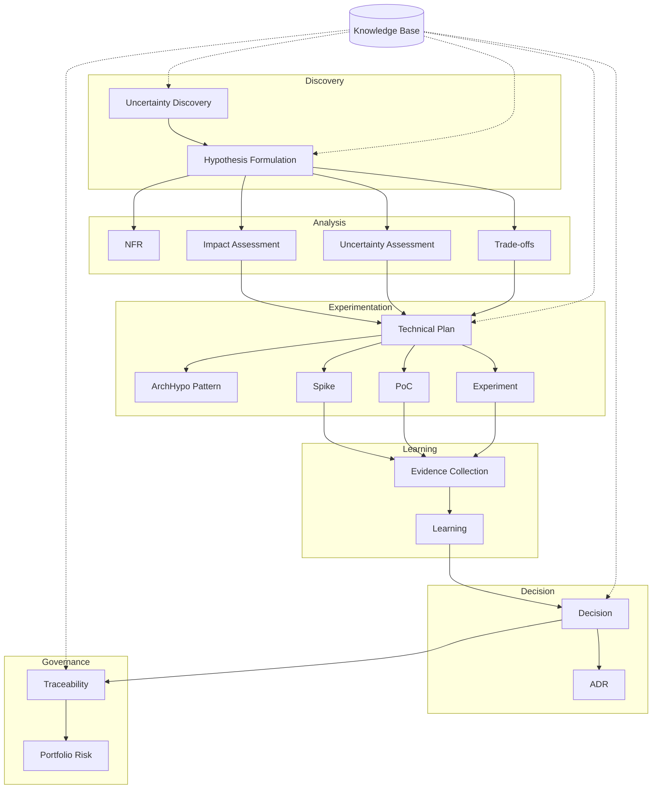

# Cognitive Reference Uncertainty Architecture (CRUA)

## Agents Catalog

| Agente                        | Tipo          | Descrição                                                   | Input                      | Output                   |
| ----------------------------- | ------------- | ----------------------------------------------------------- | -------------------------- | ------------------------ |
| Uncertainty Discovery Agent   | Discovery     | Identifica incertezas em requisitos, tecnologias e decisões | Backlog, ADRs, requisitos  | Lista de incertezas      |
| Hypothesis Formulation Agent  | Analysis      | Converte incertezas em hipóteses testáveis                  | Incertezas identificadas   | Hipóteses estruturadas   |
| NFR Agent                     | Analysis      | lassifica a hipotese em NFR                                 | Hipótese                   | NFR                      |
| Impact Assessment Agent       | Risk          | Avalia impacto potencial da hipótese                        | Hipótese                   | Score de impacto         |
| Uncertainty Assessment Agent  | Risk          | Mede nível de incerteza                                     | Hipótese, evidências       | Score de incerteza       |
| Technical Plan Agent          | Planning      | Define plano técnico para validar hipótese                  | Hipótese + risco           | Plano de experimentação  |
| Architectural Patterns Agent  | Experiment    | Classifica a hipótese dado ArchHypo Patterns                | Hipótese                   | SArchHypo Pattern        |
| Spike Design Agent            | Experiment    | Cria spikes técnicos                                        | Hipótese                   | Spike backlog            |
| PoC Agent                     | Experiment    | Gera provas de conceito                                     | Hipótese, arquitetura      | Resultado do PoC         |
| Trade-off Analysis Agent      | Analysis      | Analisa trade-offs arquiteturais                            | Alternativas arquiteturais | Matriz de trade-offs     |
| Evidence Collection Agent     | Observability | Coleta evidências dos experimentos                          | Logs, métricas, testes     | Evidências               |
| Learning Agent                | Knowledge     | Extrai aprendizados                                         | Evidências                 | Lições aprendidas        |
| Decision Agent                | Governance    | Decide confirmar, refutar ou adiar hipótese                 | Evidências e aprendizados  | Decisão                  |
| ADR Agent                     | Documentation | Gera Architecture Decision Records                          | Decisão                    | ADR                      |
| Traceability Agent            | Governance    | Liga hipótese → experimento → decisão                       | Todos os artefatos         | Grafo de rastreabilidade |
| Portfolio Risk Agent          | Portfolio     | Analisa riscos arquiteturais acumulados                     | Todas hipóteses            | Dashboard executivo      |
| Continuous Architecture Agent | Strategy      | Sugere decisões adiáveis                                    | Roadmap e hipóteses        | Backlog arquitetural     |




## Core Agent

### Mandatory Components

| Componente           | Responsabilidade              |
| -------------------- | ----------------------------- |
| Agent Orchestrator   | Coordena agentes              |
| Agent Registry       | Disponibiliza os agentes   |
| Memory Layer         | Contexto compartilhado        |
| Knowledge Layer      | ADRs, requisitos, arquitetura (RAG)|
| Governance Layer     | Permissões e auditoria        |
| Evaluation Layer     | Qualidade/Padronização das respostas       |
| Observability Layer  | Métricas dos agentes          |
| Tool Connector Layer | Integrações externas    (Opcional)      |


```mermaid
flowchart TB

    subgraph Platform["ArchHypo Agent Framework"]

        ORCH[Agent Orchestrator]

        subgraph Foundation["Foundation Services"]

            REG[Agent Registry]
            MEM[Memory Layer]
            KNOW[Knowledge Layer]
        end

        subgraph Governance["Governance Services"]

            GOV[Governance Layer]
            EVAL[Evaluation Layer]
            OBS[Observability Layer]
        end

        subgraph Integration["Integration Services"]

            TOOL[Tool Connector Layer]
        end

    end

    ORCH <--> REG

    ORCH <--> MEM
    ORCH <--> KNOW

    ORCH --> GOV
    ORCH --> EVAL
    ORCH --> OBS

    ORCH --> TOOL
  ```
