# 📑 Sumário
- [📖 User Guide](#-user-guide)
  - [Como Usar (Passo a Passo)](#-como-usar-passo-a-passo)
    - [Criar um Board Template](#%EF%B8%8F-criar-um-board-template)
    - [Criar uma Incerteza](#-criar-uma-incerteza)
    - [Add/Atualizar Métricas](#%EF%B8%8F-addatualizar-métricas)
    - [Criar Plano Técnico](#-criar-plano-técnico)
    - [Visualizar Métricass](#-visualizar-métricas)
  
## 📖 User Guide

### 🚀 Como Usar (Passo a Passo)

#### #### 🗂️ Criar um Board Template

❗❗❗ **IMPORTANTE:** Os quadros compartilhados já foram previamente configurados com as colunas necessárias. Caso esteja criando um board do zero, siga as instruções abaixo. ❗❗❗

Para utilizar o plugin ArchHypo.AI corretamente, é essencial que o quadro do Trello esteja estruturado com as colunas adequadas para o fluxo de trabalho de gestão de incertezas e decisões arquiteturais.

1. Clique no ícone de **Board** na barra lateral do Trello, conforme mostrado na imagem abaixo:

   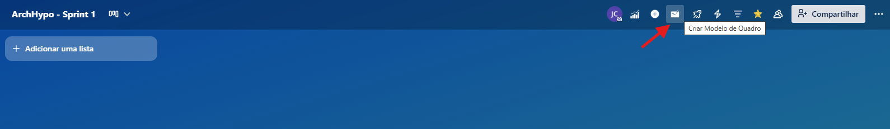

2. Crie as seguintes colunas no seu quadro:

   - `INCERTEZA`
   - `ITEM PLANO TÉCNICO`
   - `A FAZER`
   - `EM ANDAMENTO`
   - `CONCLUÍDO`

   Essas colunas organizam o processo desde a identificação de incertezas até a execução e acompanhamento das ações técnicas.

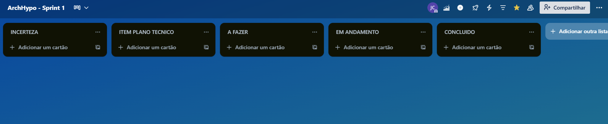

💡 *Dica:* Você pode adicionar colunas personalizadas conforme as necessidades específicas do seu projeto ou equipe.

#### ❓ Criar uma Incerteza
Clique em *"Criar uma Incerteza"* para iniciar o fluxo de criação da Incerteza.

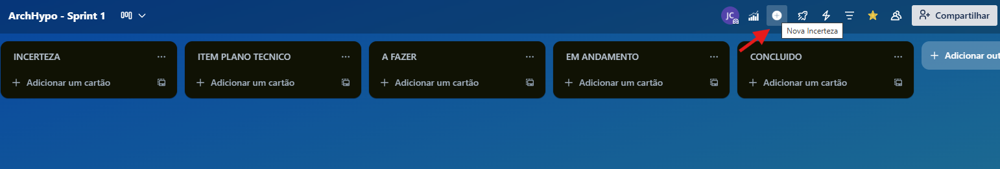

---

**1) Descreva a Incerteza:**

DIgite a incerteza arquitetural identificada com maior detalhamento possivel

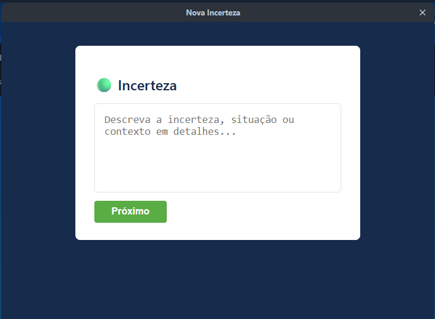

---

**2)Hipótese:**

O modelo de linguagem (LLM) sugere automaticamente uma hipótese técnica relacionada à incerteza descrita e a justificativa.
Exemplo de hipótese sugerida:
_"A principal incerteza reside em como garantir a eficácia e a colaboração fluída entre os Agentes LLM..."_

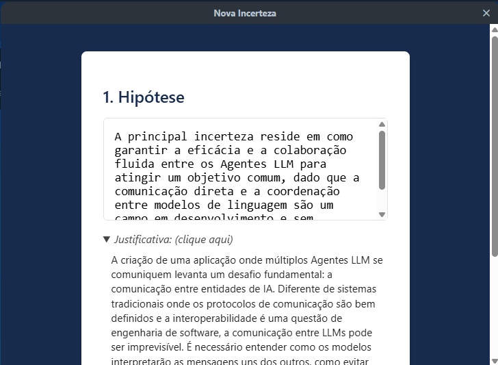

⚠️**Atenção:** Ao retornar a uma etapa anterior, os valores sugeridos pelo LLM podem ser perdidos e precisarão ser reeditados.

⚠️**Atenção:** O usuário pode editar qualquer informação sugerido pelo LLM porém o ArchHypo.AI Plugin solicitará uma justificativa para ser utilizada no aprendizado do LLM.

---

**3) Requisito Não Funcional (NFR):**

O sistema solicita que o usuário selecione ou justifique o **Requisito Não Funcional** relacionado à hipótese. Exemplos incluem:

- Desempenho
- Segurança
- Confiabilidade
- Flexibilidade
- Usabilidade
- Produtividade

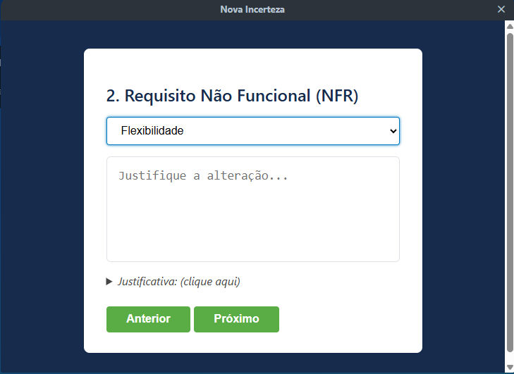

⚠️**Atenção:** Ao retornar a uma etapa anterior, os valores sugeridos pelo LLM podem ser perdidos e precisarão ser reeditados.

⚠️**Atenção:** O usuário pode editar qualquer informação sugerido pelo LLM porém o ArchHypo.AI Plugin solicitará uma justificativa para ser utilizada no aprendizado do LLM.

---

**4)Avaliação da Incerteza:**

Nesta etapa, o usuário deve classificar o **nível de incerteza** associado à hipótese. Os níveis disponíveis são:

- Muito Alto
- Alto  
- Médio  
- Baixo
- Muito Baixo

  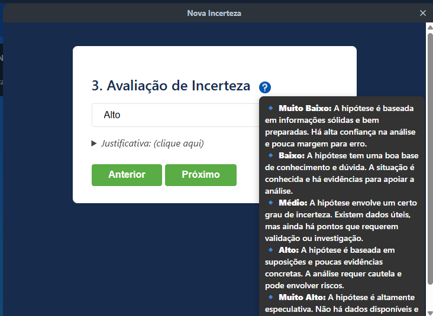

Essa classificação representa o grau de desconhecimento ou risco técnico envolvido.

⚠️**Atenção:** Ao retornar a uma etapa anterior, os valores sugeridos pelo LLM podem ser perdidos e precisarão ser reeditados.

⚠️**Atenção:** O usuário pode editar qualquer informação sugerido pelo LLM porém o ArchHypo.AI Plugin solicitará uma justificativa para ser utilizada no aprendizado do LLM.

---

**5)Avaliação do Impacto:**

O sistema também solicita que o usuário avalie o **impacto potencial** da hipótese na arquitetura do sistema. Os níveis disponíveis são:

- Muito Alto
- Alto  
- Médio  
- Baixo
- Muito Baixo
  
  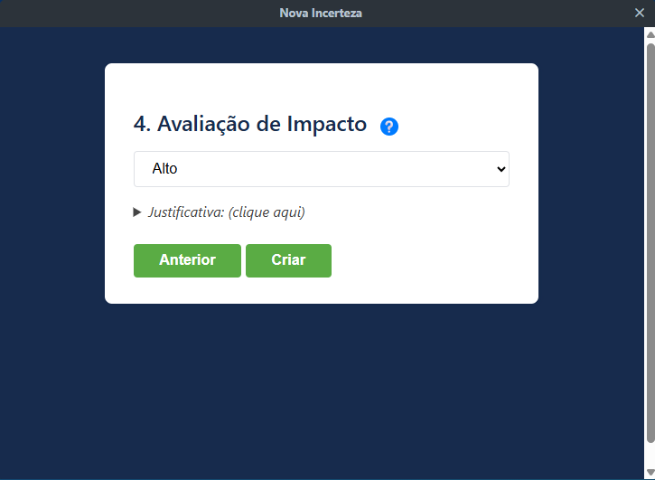
  
O impacto deve ser avaliado com base em critérios como:

- Complexidade de implementação  
- Riscos para desempenho, segurança ou interoperabilidade  
- Dependência entre componentes

⚠️**Atenção:** Ao retornar a uma etapa anterior, os valores sugeridos pelo LLM podem ser perdidos e precisarão ser reeditados.

⚠️**Atenção:** O usuário pode editar qualquer informação sugerido pelo LLM porém o ArchHypo.AI Plugin solicitará uma justificativa para ser utilizada no aprendizado do LLM.

---

Após preencher todos os campos, o plugin cria automaticamente um **card no Trello** com as informações da incerteza e da hipótese.

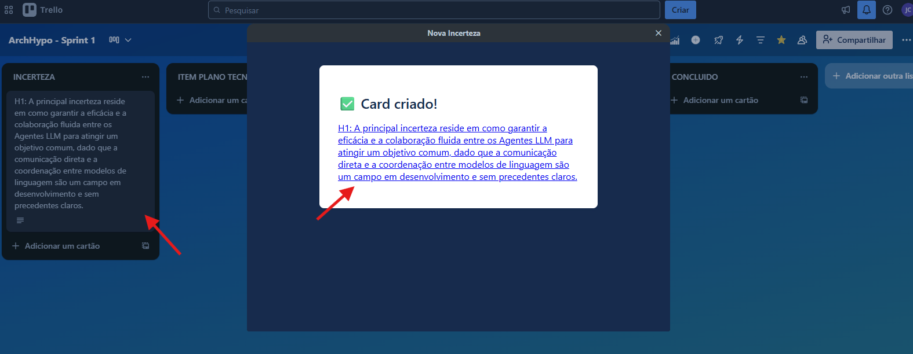

---

#### 🏷️ Add/Atualizar Métricas  

Para adicionar ou atualizar as métricas nos cards do Trello, o usuário deve acessar o card de Hipótese ou o Item do Plano Técnico e utilizar o botão conforme ilustrado abaixo:

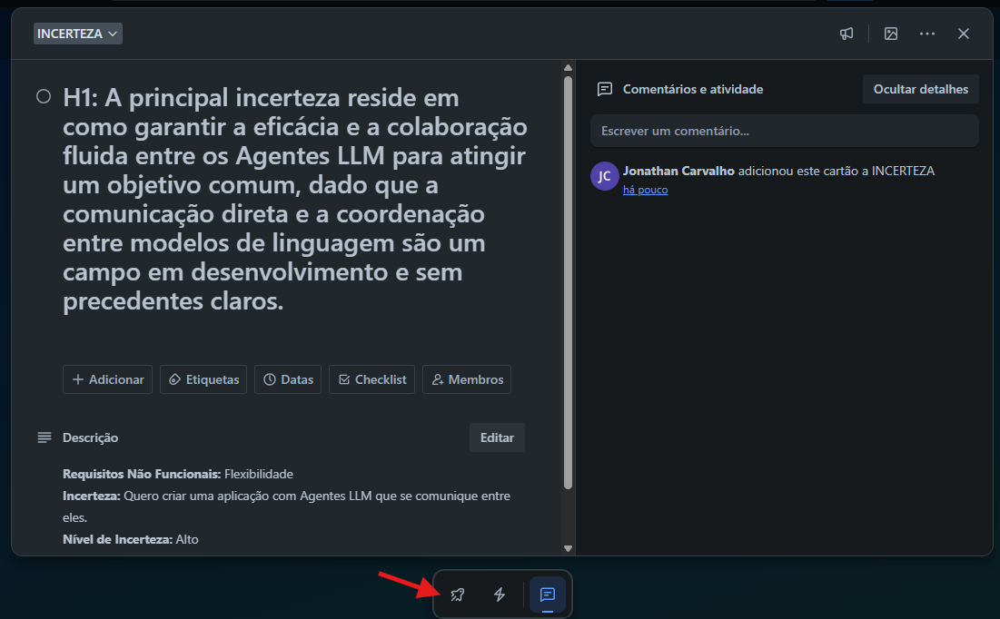

Em seguida, clique em "Add/Atualizar Métricas" para incluir ou modificar os labels correspondentes:

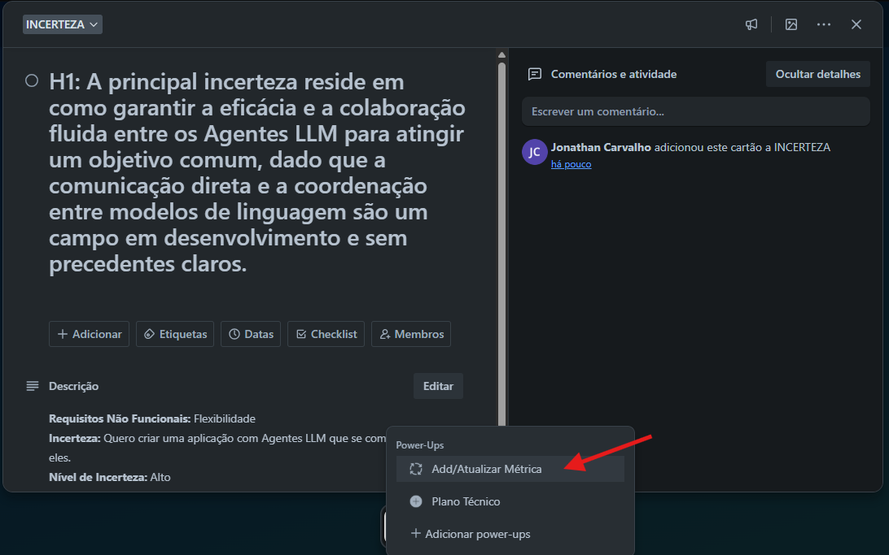

As métricas adicionadas variam conforme o tipo de card:

- Hipóteses → *Nível de Incerteza, Impacto e Requisito Não Funcional*
- Itens do Plano Técnico → *Padrões ArchHypo*

Após a ação, os labels serão exibidos conforme o exemplo:

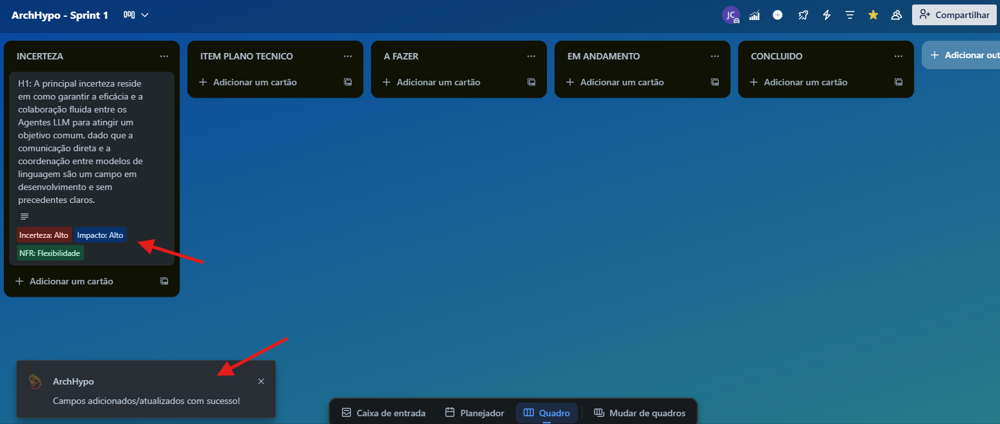

#### 📋 Criar Plano Técnico  
   - Abra o card da hipótese criada.  
   - Clique em *"Plano Técnico"* → *"Gerar Plano Técnico"*.  
   - Selecione os itens sugeridos para editar ou gerar padrões ArchHypo.  
   - 💡 O LLM sugere informações + justificativas (editáveis).

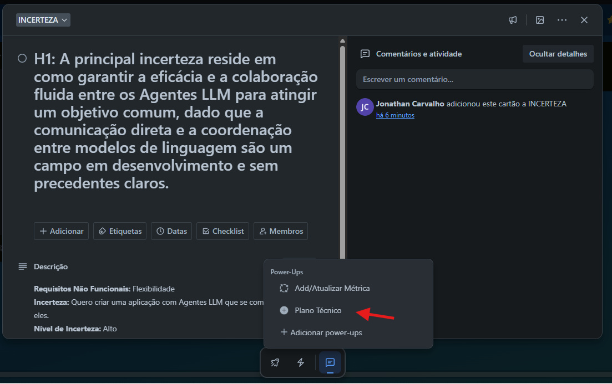

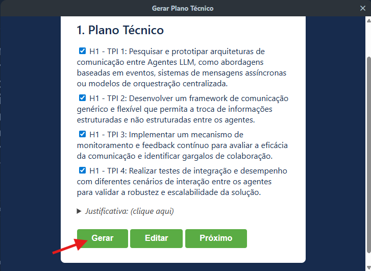

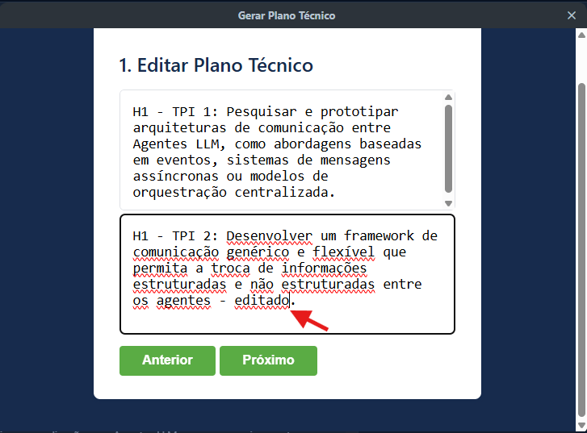

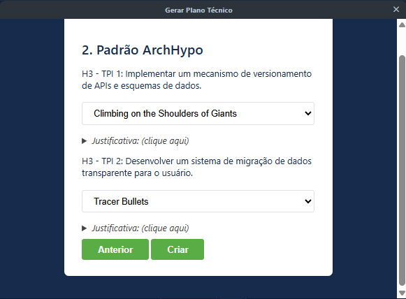

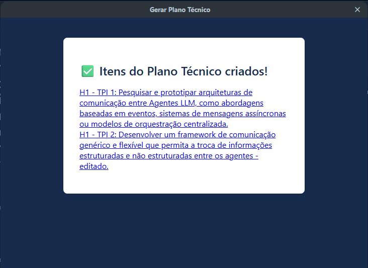

   - Os itens são adicionados na coluna **ITEMS PLANO TÉCNICO**, com IDs no formato:  
     - `H1` → Hipótese 1  
     - `TPI1` → Tech Plan Item 1

   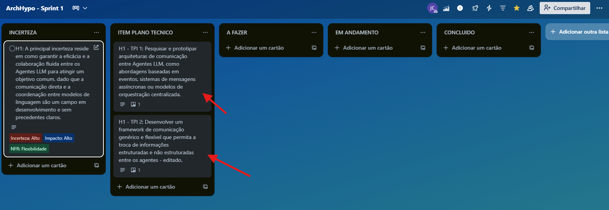
   
#### 📊 **Visualizar Métricas** 

Utilize o recurso *ArchHypo Métricas* para acompanhar a quantidade de cards classificados conforme descrito na seção Adicionar ou Atualizar Métricas.

Para acessar, clique no botão indicado na imagem abaixo:

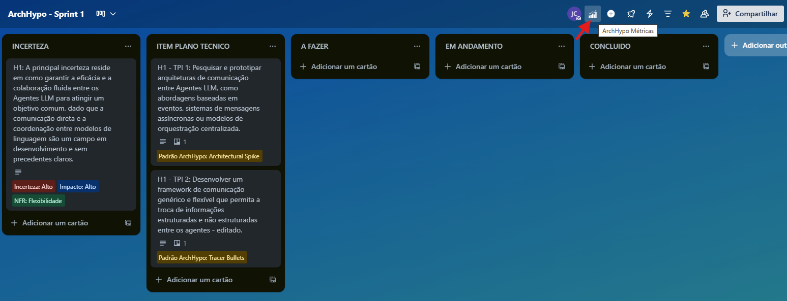

O painel apresenta diferentes tipos de gráficos, como:

- Quantidade de hipóteses com Nível de Incerteza e Impacto
- Quantidade de hipóteses com Requisitos Não Funcionais (NFR)
- Quantidade de itens do plano técnico com o [Padrões ArchHypo](README-padroes.md)

  
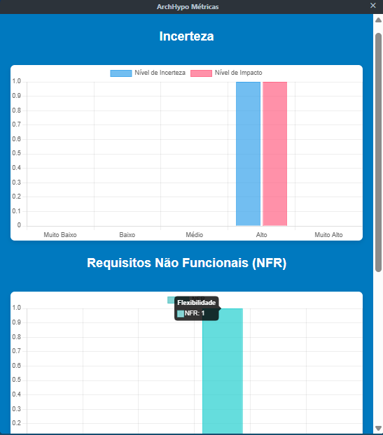

--------------------------------------------------------------------------------------------------------------------

ArchHypo.AI Plugin

Equipe de Pesquisa e Desenvolvimento

[https://github.com/jonathancs-tester/ArchHypo-Trello-Plugin](https://github.com/jonathancs-tester/ArchHypo-Trello-Plugin)

