# 📑 Summary
- [📖 User Guide](#-user-guide)
  - [Select Language](#-select-language)
  - [How to Use (Step-by-Step)](#-how-to-use-step-by-step)
    - [Create a Board Template](#%EF%B8%8F-create-a-board-template)
    - [Create an Uncertainty](#-create-an-uncertainty)
    - [Add/Update Metrics](#%EF%B8%8F-addupdate-metrics)
    - [Create Technical Plan](#-create-technical-plan)
    - [View Metrics](#-view-metrics)
  
## 📖 User Guide

### 🌐 Select Language

This feature allows users to choose between Portuguese (PT) and English (EN) to view the board information in their preferred language.

 - Look for the button or dropdown menu with the language option at the top or in a highlighted section of the board.
 - Click **Português** for Portuguese or **English** for English.

 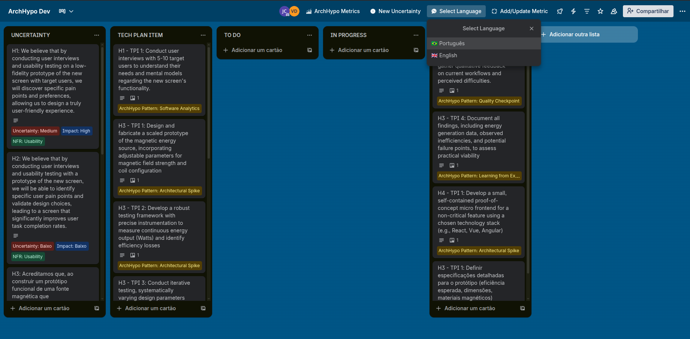

After selection, the board's titles, descriptions, and labels will be automatically updated to the chosen language.

### 🚀 How to Use (Step-by-Step)

#### 🗂️ Create a Board Template

❗❗❗ **IMPORTANT:** Shared boards have already been pre-configured with the necessary columns. If you are creating a board from scratch, follow the instructions below. ❗❗❗

To use the ArchHypo.AI plugin correctly, it is essential that the Trello board is structured with the appropriate columns for the uncertainty and architectural decision management workflow.

⚠️ Warning: If the columns are already defined, the `Create Board Template` button will not be displayed. In this situation, this procedure is not necessary.

1. Click the **Board** icon on the Trello sidebar, as shown in the image below:

   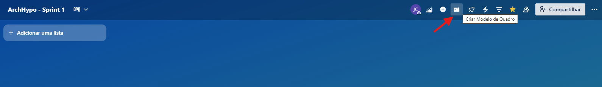

3. Create the following columns on your board:

   - `UNCERTAINTY`
   - `TECHNICAL PLAN ITEM`
   - `TO DO`
   - `IN PROGRESS`
   - `DONE`

   These columns organize the process from identifying uncertainties to executing and monitoring technical actions.

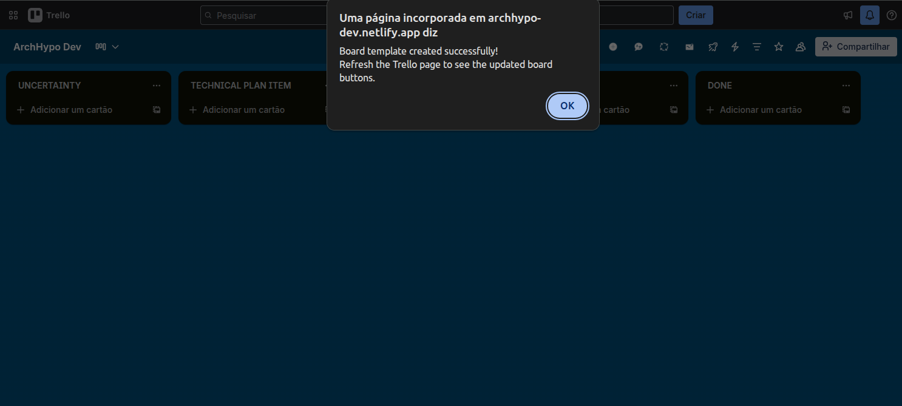

💡 *Tip:* You can add custom columns according to the specific needs of your project or team.

#### ❓ Create an Uncertainty
Click on *"Create an Uncertainty"* to start the Uncertainty creation workflow.

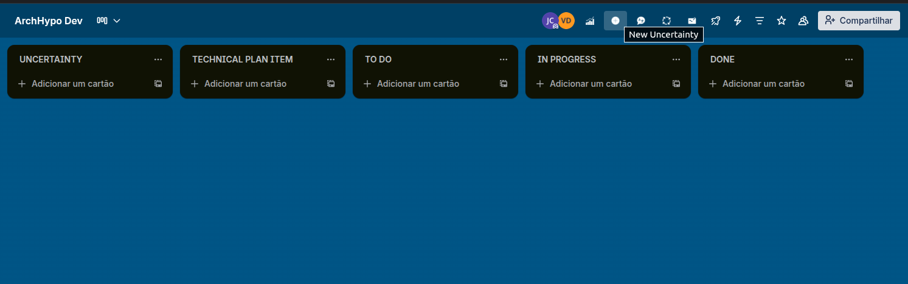

---

**1) Describe the Uncertainty:**

Enter the identified architectural uncertainty with as much detail as possible.

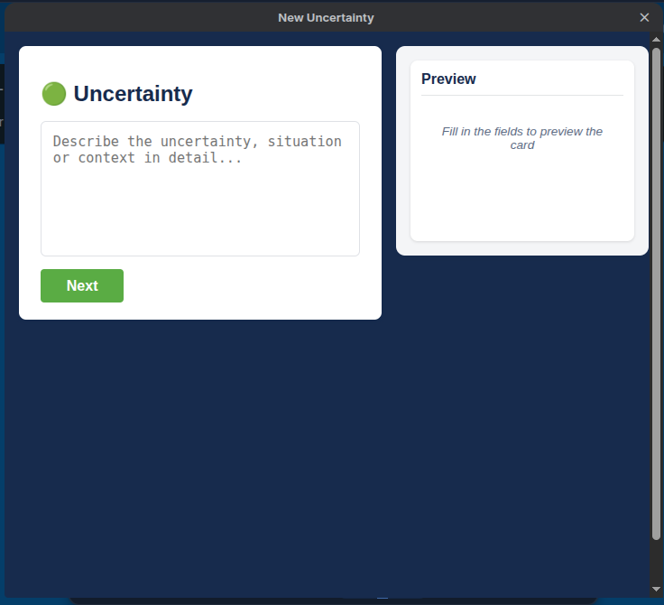

---

**2) Hypothesis:**

The language model (LLM) automatically suggests a technical hypothesis related to the described uncertainty and its justification.
Example of a suggested hypothesis:
_"We want to add LLMs to our product to improve text generation capabilities..."_

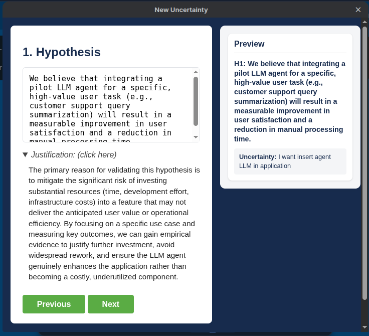

⚠️**Warning:** When returning to a previous step, the values suggested by the LLM may be lost and will need to be re-edited.

⚠️**Warning:** The user can edit any information suggested by the LLM, but the ArchHypo.AI Plugin will request a justification to be used for LLM training.

---

**3) Non-Functional Requirement (NFR):**

The system prompts the user to select or justify the **Non-Functional Requirement** related to the hypothesis. Examples include:

- Performance
- Security
- Reliability
- Flexibility
- Usability
- Productivity

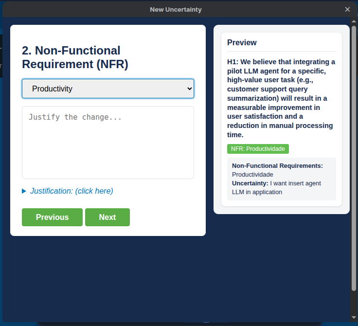

⚠️**Warning:** When returning to a previous step, the values suggested by the LLM may be lost and will need to be re-edited.

⚠️**Warning:** The user can edit any information suggested by the LLM, but the ArchHypo.AI Plugin will request a justification to be used for LLM training.

---

**4) Uncertainty Assessment:**

In this step, the user must classify the **level of uncertainty** associated with the hypothesis. The available levels are:

- Very High
- High  
- Medium  
- Low
- Very Low

  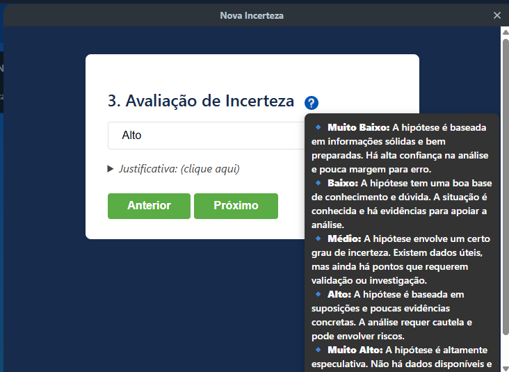

This classification represents the degree of technical unknown or risk involved.

ℹ️ **Information:** The LLM uses previously classified cards to generate more accurate and contextualized recommendations, as shown in the figure below:

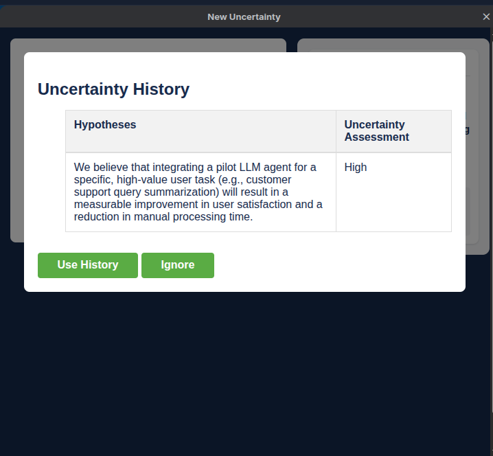

⚠️**Warning:** When returning to a previous step, the values suggested by the LLM may be lost and will need to be re-edited.

⚠️**Warning:** The user can edit any information suggested by the LLM, but the ArchHypo.AI Plugin will request a justification to be used for LLM training.

---

**5) Impact Assessment:**

The system also asks the user to assess the **potential impact** of the hypothesis on the system's architecture, considering the plausible worst-case scenario. 

The available levels are:

- Very High
- High  
- Medium  
- Low
- Very Low
  
  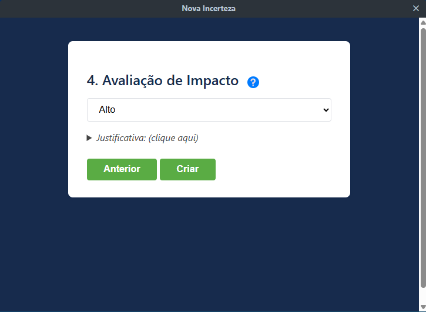
  
**How to assess the impact?**

The choice of impact level should consider the following criteria:

 - Implementation complexity: Does the hypothesis require significant changes or introduce new technologies?
 - Risks to performance, security, or interoperability: Could the hypothesis compromise critical aspects of the system?
 - Dependency between components: Does the hypothesis affect multiple modules or require changes in interdependent parts?

ℹ️ **Information:** The LLM uses previously classified cards to generate more accurate and contextualized recommendations, as shown in the figure below:

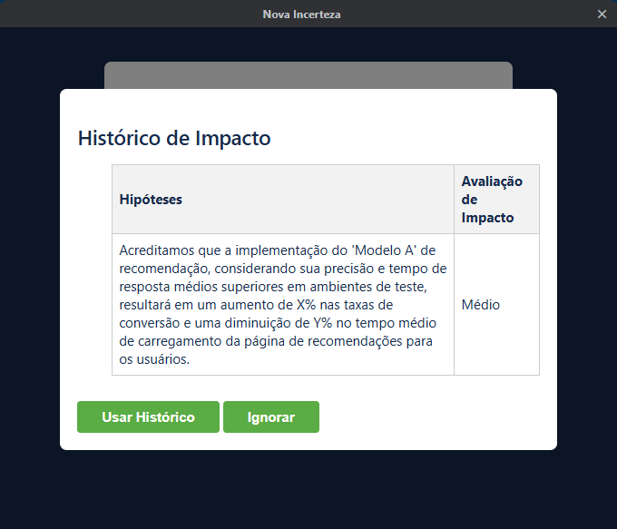

⚠️**Warning:** When returning to a previous step, the values suggested by the LLM may be lost and will need to be re-edited.

⚠️**Warning:** The user can edit any information suggested by the LLM, but the ArchHypo.AI Plugin will request a justification to be used for LLM training.

---

After filling in all the fields, the plugin automatically creates a **Trello card** with the uncertainty and hypothesis information.

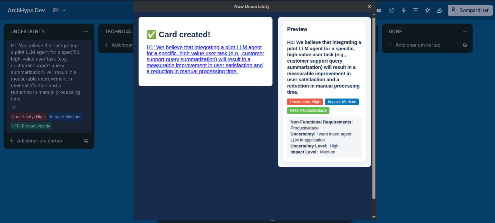

---

#### 🏷️ Add/Update Metrics  

To add or update metrics on Trello cards, the user must enable "Add/Update Metrics" to include or modify the corresponding labels:

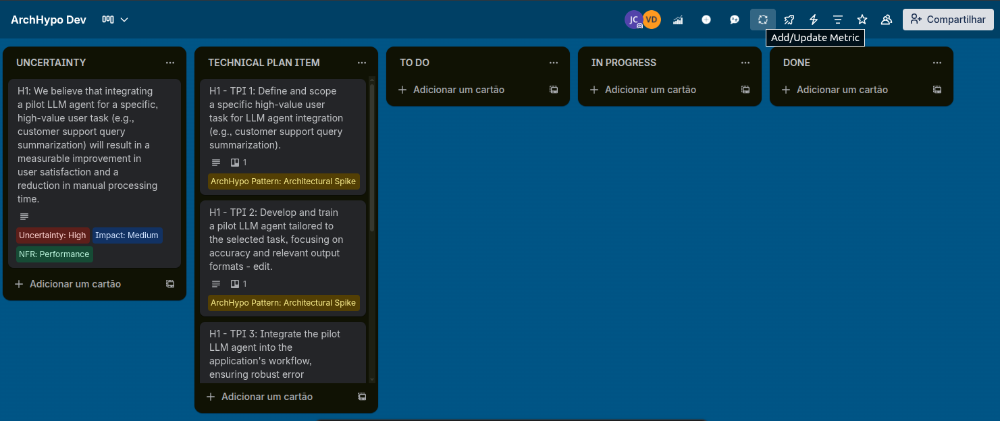

The added metrics vary depending on the card type:

- Hypotheses → *Uncertainty Level, Impact, and Non-Functional Requirement*
- Technical Plan Items → *ArchHypo Patterns*

After the action, the labels will be displayed as in the example:
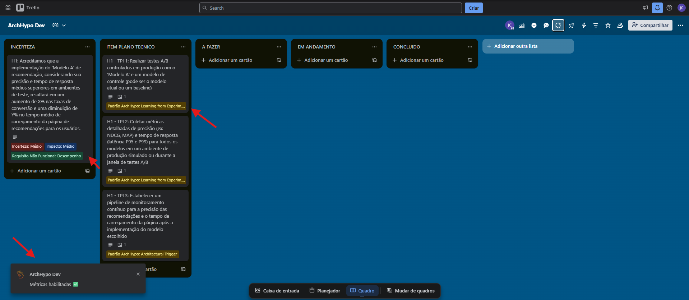

ℹ️ **Information:** Once enabled, the card metrics are automatically updated every 1 second.

#### 📋 Create Technical Plan  

From a previously created Hypothesis, the user can generate a Technical Plan to reduce the level of uncertainty associated with the hypothesis.

**1) Access the Hypothesis Card:**

The first step is to access the desired hypothesis card and click the button indicated in the image below:

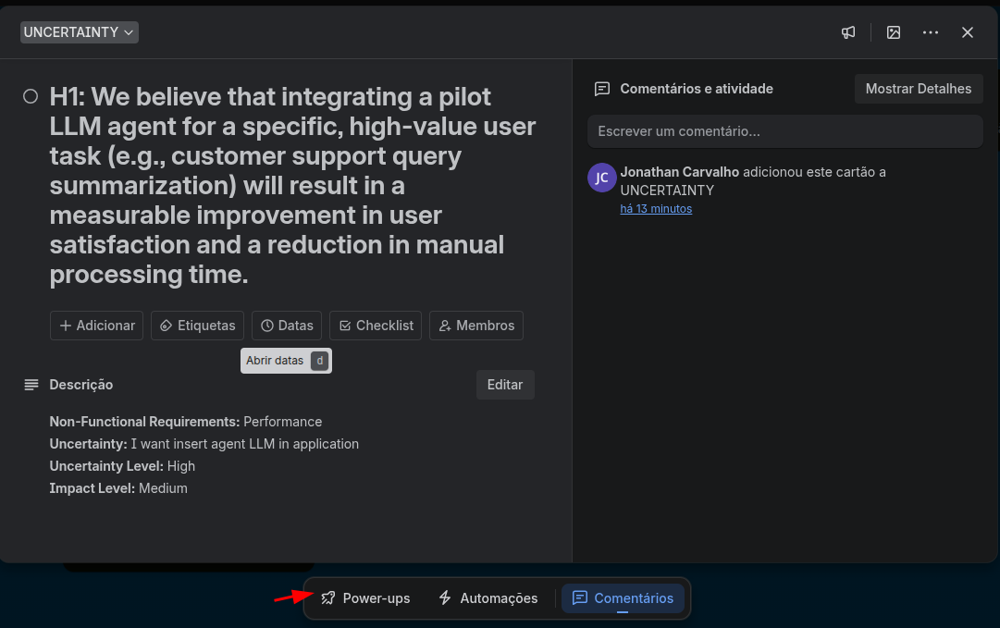

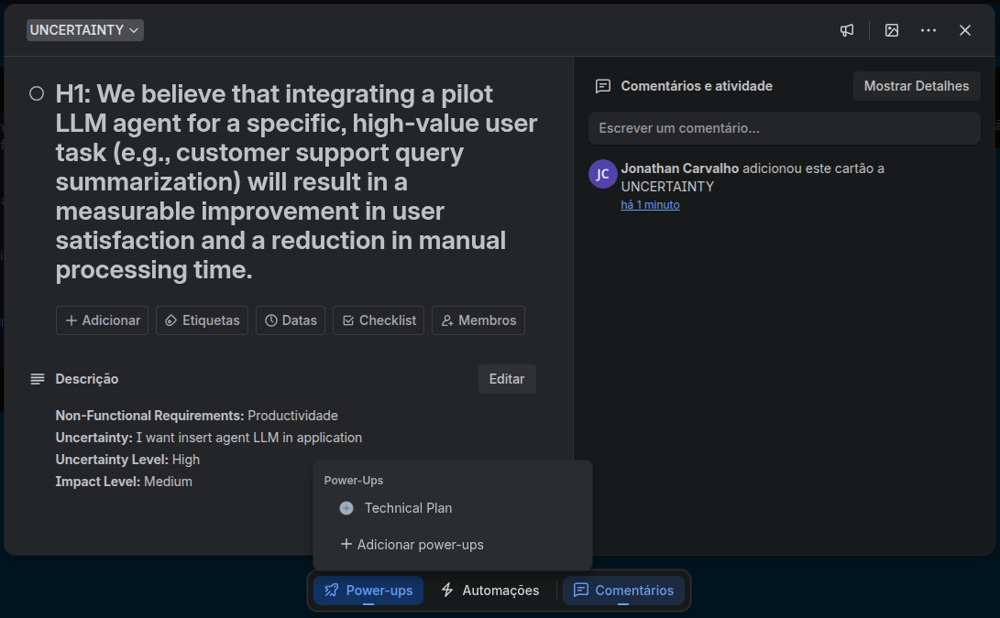

---

**2) Generate Technical Plan Items:**

When clicking **Generate**, the LLM automatically creates up to **5 standardized technical items**, based on the selected hypothesis:

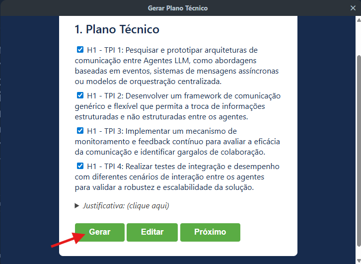

After selecting the items, the user can click **Next** to start classifying the patterns or **Edit** to modify the previously entered information.

---
**3) Select and Edit Items:**

After the items are generated, the user can select the most relevant items and edit their contents as needed:

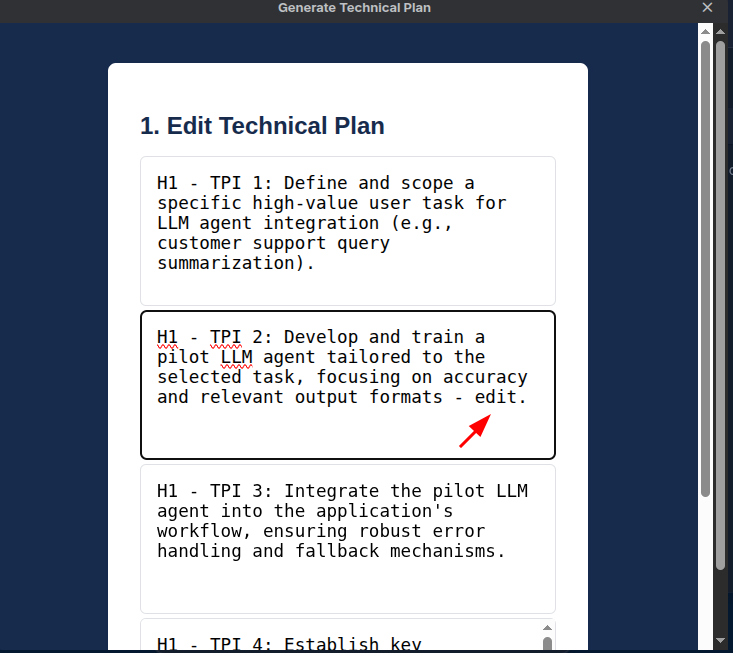

After selecting and editing the items, the user can click **Next** to start the pattern classification.

**4) Classification of ArchHypo Patterns:**

Once the selection is complete, the LLM automatically classifies the items based on ArchHypo Patterns, providing a justification for each choice:

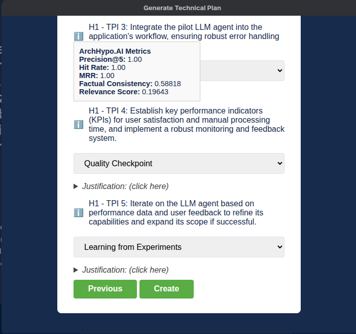

If the user wishes to change the suggested pattern, it is possible to select another from those available in the documentation: [ArchHypo Patterns](README-padroes.md) 

**5) Create Items on the Board:**

By clicking `Create`, the selected items are automatically added to the `TECHNICAL PLAN ITEMS` column, with the following naming convention:

- H1 → Hypothesis 1
- TPI1 → Tech Plan Item 1

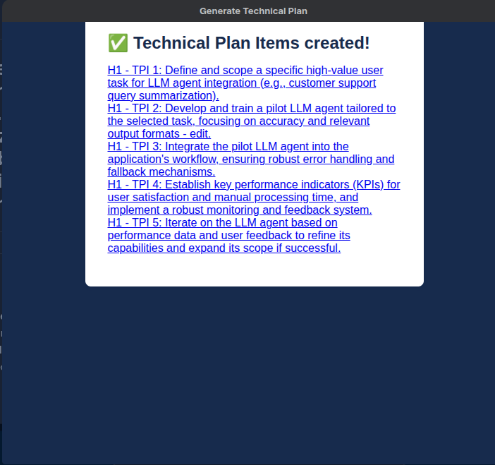

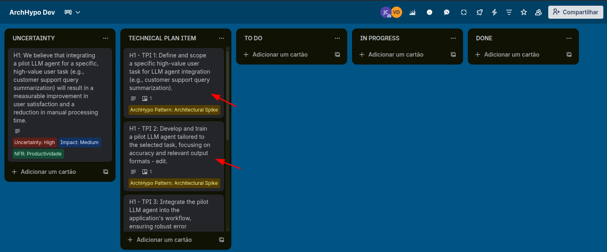

 ---
   
#### 📊 **View Metrics** Use the *ArchHypo Metrics* feature to track the number of classified cards as described in the `Add/Update Metrics` section.

To access it, click the button indicated in the image below:

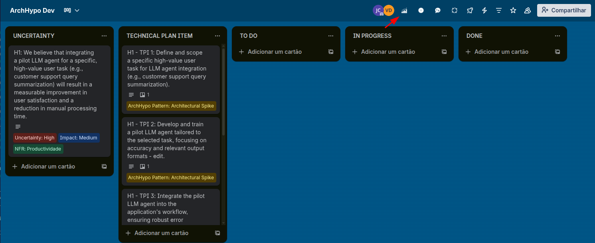

The panel displays different types of charts, such as:

- Number of hypotheses by Uncertainty Level and Impact
- Number of hypotheses by Non-Functional Requirements (NFR)
- Number of technical plan items by [ArchHypo Patterns](README-padroes.md)

  
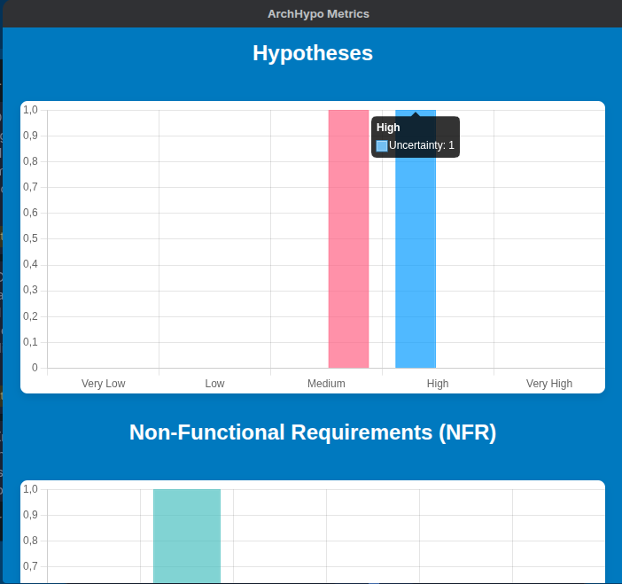

--------------------------------------------------------------------------------------------------------------------

ArchHypo.AI Plugin

Research and Development Team

[🔗 GitHub Repository](https://github.com/jonathancs-tester/ArchHypo-Trello-Plugin)